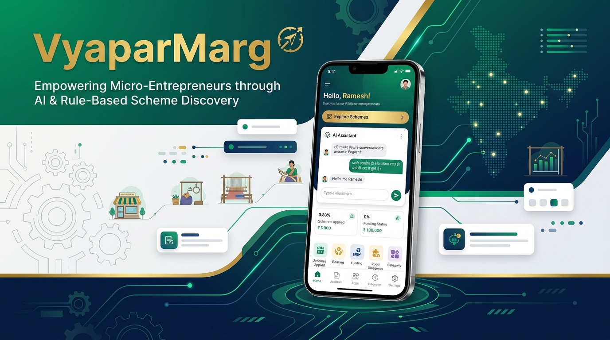
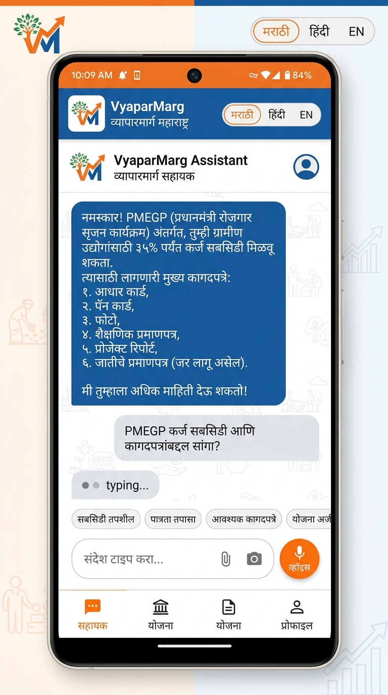
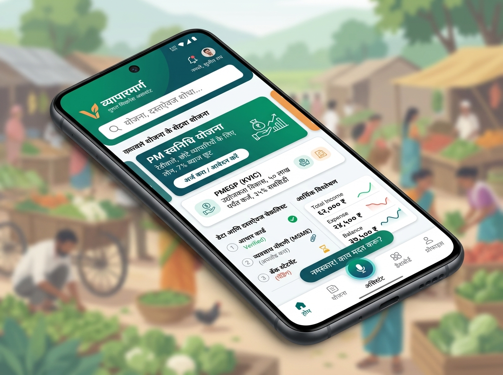
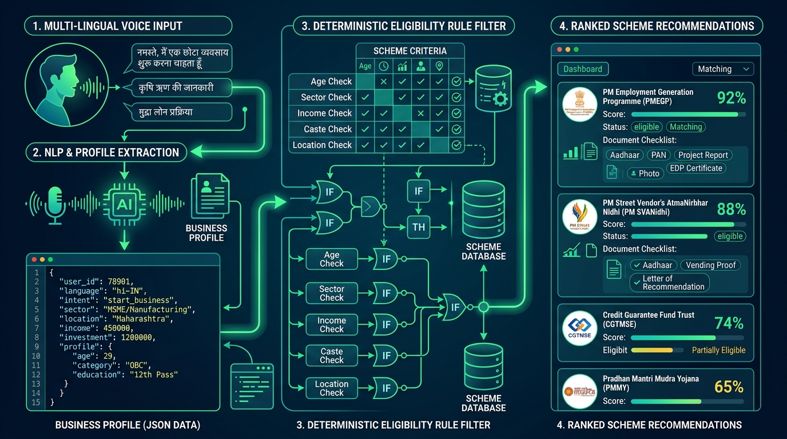
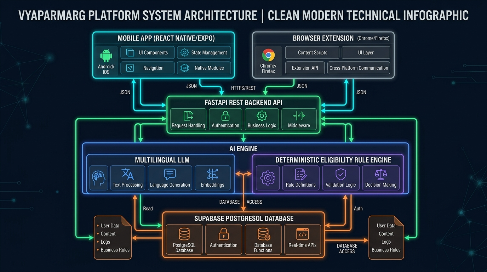
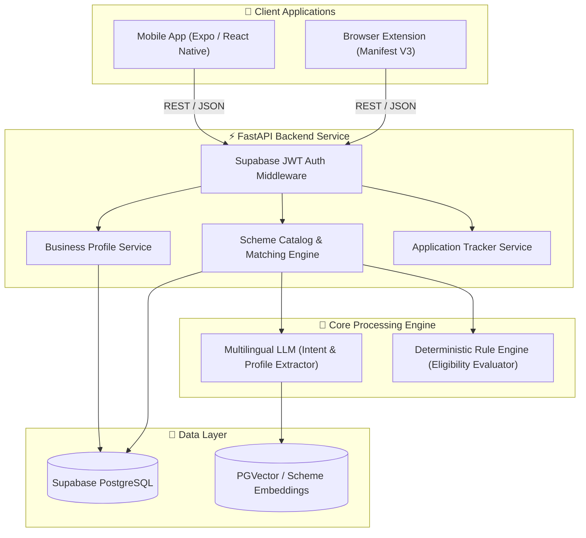

<div align="center">

# 🌾 VyaparMarg (व्यापारमार्ग)
### AI & Rule-Based Rural Business Assistant & Scheme Discovery Engine

[](https://github.com)
[](https://github.com)
[](https://fastapi.tiangolo.com)
[](https://supabase.com)
[](https://reactnative.dev)



</div>

---

## 📌 Project Overview & Metadata

* **Project Title**: **VyaparMarg** — AI & Rule-Based Business Assistant for Micro-Entrepreneurs
* **Subject / Lab**: **IDEA Lab Project Review**
* **Student Name**: **Rangesh Gupta**
* **Roll No**: **53**
* **Class & Division**: **SE CPMN A**
* **Faculty Guide**: **Prof. Archana Belge Ma'am**
* **Repository**: [`VyaparMarg`](https://github.com)

---

## 🚀 Problem Statement & Vision

The canonical project definition is maintained in [`docs/PROJECT_CANONICAL_SPEC.md`](docs/PROJECT_CANONICAL_SPEC.md). All AI tools and IDE agents must read it before analyzing or modifying this repository.

**Main problem statement:** There is no unified digital platform tailored to rural entrepreneurs that combines sales, payments, logistics, and customer support. This fragmentation restricts market access and sustainable scaling of rural businesses.

**Assigned sub-problem:** Rural entrepreneurs do not know which government schemes, marketplaces, or digital tools fit their business.

VyaparMarg addresses this assigned sub-problem through a **multilingual Rural Business Assistant** delivered as a real Android mobile application and a browser extension, backed by a shared API, database, recommendation engine, and AI layer.

**VyaparMarg** addresses this challenge through a **hybrid AI + Deterministic Rule Engine**:
1. **AI Assistant Layer**: Understands natural conversational inputs in regional languages (Marathi, Hindi, English), extracts structured business profile context, and translates requirements into simple terms.
2. **Deterministic Rule Engine**: Enforces strict eligibility criteria (turnover, geography, registration status, gender, caste category, sector) deterministically to prevent false promises or LLM hallucinations.
3. **Multi-Channel Delivery**: Available as a **Mobile Assistant App** for business owners and a **Browser Extension** for field workers/CSC agents.

---

## 🎨 Visual Showcase & Previews

### 1. Mobile Assistant Native Interface



### 2. Hybrid AI + Eligibility Engine Workflow


### 3. System Architecture Diagram


---

## 🏗️ Architecture & Component Breakdown



---

## 🛠️ Tech Stack & Technologies

* **Backend**: Python 3.11+, FastAPI, Pydantic v2, Uvicorn, Pytest
* **Database & Auth**: Supabase PostgreSQL, RLS Policies, Supabase Auth (JWT), Edge Functions
* **AI & NLP**: Multilingual LLM Integration, Custom Scheme Parser, Structured JSON Extraction
* **Frontend Apps**: React Native / Expo (Mobile), TypeScript (Extension & Monorepo)
* **Monorepo Tools**: `pnpm` workspace, Pytest, Python Virtual Environment (`.venv`)

---

## 📁 Repository Structure

```
VyaparMarg/
├── apps/
│   ├── mobile/             # React Native / Expo Mobile App
│   ├── mobile-native/      # Android / iOS Native modules
│   └── extension/          # Browser extension for CSC / Field Agents
├── services/
│   ├── ai/                 # LLM profile extraction & multilingual query module
│   ├── api/                # FastAPI Application Routes & Middleware
│   ├── documents/          # Document requirement checklist engine
│   └── schemes/            # Deterministic scheme eligibility scoring engine
├── packages/
│   ├── api-client/         # Shared API Client SDK
│   ├── config/             # Environment & configuration schemas
│   ├── schemas/            # Shared Pydantic / TypeScript data models
│   └── types/              # Monorepo type definitions
├── supabase/
│   ├── migrations/         # PostgreSQL schema migrations
│   ├── functions/          # Supabase Edge Functions
│   └── seed/               # Database seed data for schemes & test profiles
├── data/                   # Schemes master data & JSON benchmarks
├── docs/                   # Architecture specs, API contracts, and asset diagrams
└── README.md               # Main Project Documentation
```

---

## ⚡ Quick Start & Local Setup Guide

### 1. Prerequisites
* **Python**: `3.11+`
* **Node.js**: `v18+` & `pnpm`
* **Supabase CLI** (optional for local DB migrations)

### 2. Environment Setup
```bash
# Clone the repository
git clone https://github.com/RangeshGupta/VyaparMarg.git
cd VyaparMarg

# Activate Python Virtual Environment
.venv\Scripts\activate

# Install Node dependencies across monorepo
pnpm install
```

### 3. Run FastAPI Backend Server
```bash
uvicorn services.api.main:app --reload --port 8000
```
API Documentation will be available live at: `http://localhost:8000/docs`

### 4. Run Mobile Assistant (Expo)
```bash
cd apps/mobile
pnpm dev
```

---

## 🧪 Testing & Quality Assurance

Run the comprehensive unit & integration test suite:

```bash
pytest services/ -v
```

---

## 📄 License & Presentation Note

This project is developed and presented for **IDEA Lab Review**:
- **Author**: Rangesh Gupta (Roll No 53, SE CPMN A)
- **Guided by**: Prof. Archana Belge Ma'am
- **Institution**: Department of Computer Engineering / CPMN

---
<div align="center">
⭐ <i>Empowering India's Micro-Entrepreneurs with AI & Deterministic Scheme Discovery</i> ⭐
</div>
